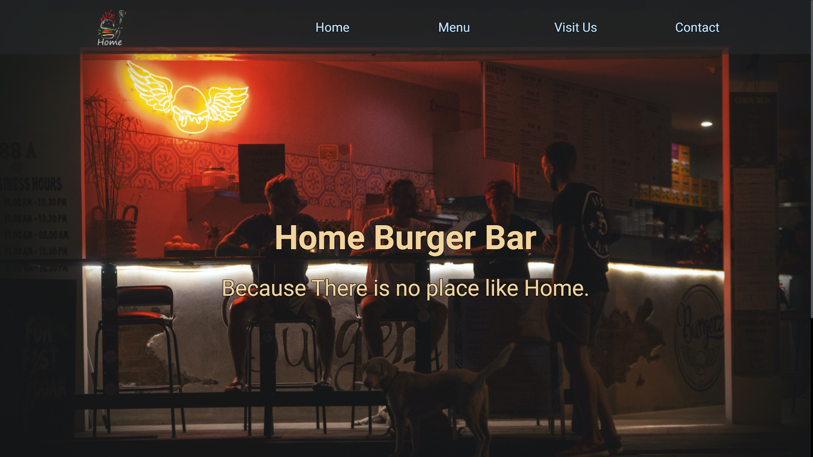
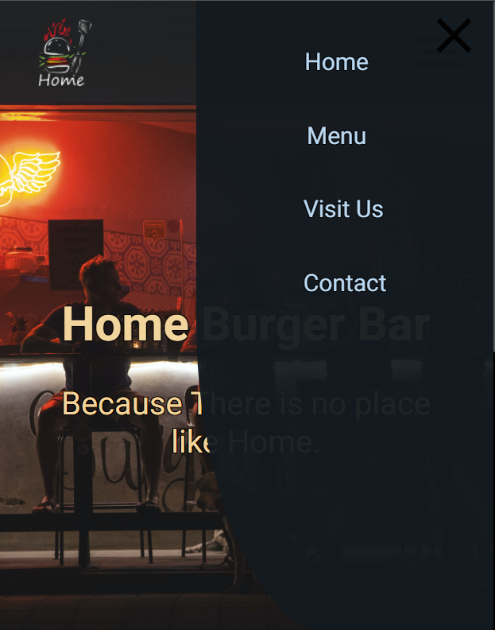

# Restaurant Web Page Demo

## Description

This a demo for a restaurant web page that uses tabbed browsing to access different pages. All contents of the page were dynamically created and rendered using Javascript DOM manipulation. The project was bundled with WebPack.

## Web Layout

## Mobile Layout

## Demonstration

[Live Demo Here!](https://mothersky.github.io/restaurant-page/)